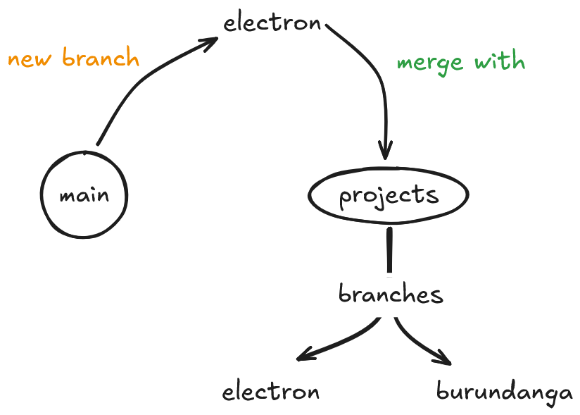

# learning
Collection of my learning projects.

# modus
<p align="center">
  
</p>

    # structure
    The way projects are organized:
    - "main" tree (base)
    - "projects" tree
        - tech I'm learning
            - project
                - subproject (optional)

    # projects
    Based on technologies I'm learning.
    
    # index
    `path (tree) | date-create (mm/dd/yyyy) | title`
    
    Example:
    ```
    root
        projects
            electron
                (6/4/2025) tutorial-electron-app-start
            burundanga
                (6/9/2026) GTA-VI-fortran
    ```
    
    # project
    Techs and Projects are stored in general in "project" branch:
    
    ```bash
    git checkout projects
    ```
